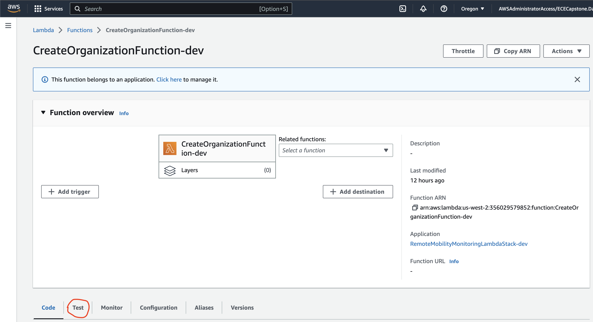
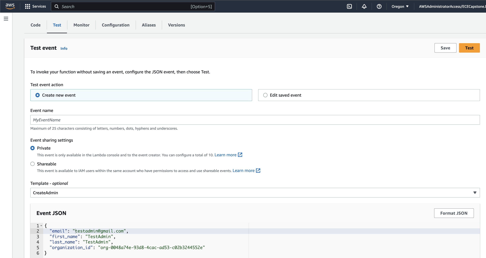

# Requirements
Before you deploy, you must have the following in place:
*  [Git](https://git-scm.com/)
*  [GitHub Account](https://github.com/)
*  [AWS Account](https://aws.amazon.com/account/)
*  [AWS CLI](https://aws.amazon.com/cli/)
*  [AWS CDK](https://docs.aws.amazon.com/cdk/latest/guide/getting_started.html)
*  [Amazon Corretto 11](https://docs.aws.amazon.com/corretto/latest/corretto-11-ug/downloads-list.html)
*  [Maven](https://maven.apache.org/)
*  [Node.js](https://nodejs.org/en/)
*  [Docker](https://www.docker.com/)

# Step 1: Clone The Repository
First, clone the GitHub repository onto your machine. To do this:
1. Create a folder on your desktop to contain the code.
2. Open terminal (or command prompt if on windows) and **cd** into the above folder.
3. Clone the GitHub repository by entering the following:
```bash
git clone https://github.com/UBC-CIC/remote-mobility-monitoring.git
```

The code should now be in the above folder. Now navigate into the remote-mobility-monitoring folder by running the following command:
```bash
cd remote-mobility-monitoring
```

# Step 2: Backend Deployment
Now that you have the code, you can deploy the backend. To do this:
1. Navigate into the backend folder by running the following command:
```bash
cd backend
```

2. Run the following command to install the CDK dependencies:
```bash
npm install
```

3. Run the following command to build the CDK code:
```bash
npm run build
```

4. Run the following command to spin up the AWS DynamoDB docker container for local testing:
```bash
docker-compose up -d
```

5. Run the following command to build the Java AWS Lambda code:
```bash
mvn clean package
```

6. Run the following commands to initialize the CDK stacks (required only if you have not deployed this stack before). Note that by default, all stacks are created in `us-west-2` due to region restrictions for Amazon Timestream.
```bash
cdk synth
cdk bootstrap aws://YOUR_AWS_ACCOUNT_ID/us-west-2
```

If you have multiple AWS CLI profiles, you can specify the profile to use by running the following commands instead:
```bash
cdk synth --profile YOUR_AWS_CLI_PROFILE
cdk bootstrap aws://YOUR_AWS_ACCOUNT_ID/us-west-2 --profile YOUR_AWS_CLI_PROFILE
```

7. Lastly, deploy the CDK stacks:
```bash
cdk deploy --all --profile YOUR_AWS_CLI_PROFILE
```

8. Optionally, the CDK stacks can be deployed individually by running the following commands:
```bash
cdk deploy RemoteMobilityMonitoringCognitoStack-dev --profile YOUR_AWS_CLI_PROFILE
cdk deploy RemoteMobilityMonitoringCognitoStack-prod --profile YOUR_AWS_CLI_PROFILE
cdk deploy RemoteMobilityMonitoringDynamoStack-dev --profile YOUR_AWS_CLI_PROFILE
cdk deploy RemoteMobilityMonitoringDynamoStack-prod --profile YOUR_AWS_CLI_PROFILE
cdk deploy RemoteMobilityMonitoringSesStack --profile YOUR_AWS_CLI_PROFILE
cdk deploy RemoteMobilityMonitoringTimestreamStack-dev --profile YOUR_AWS_CLI_PROFILE
cdk deploy RemoteMobilityMonitoringTimestreamStack-prod --profile YOUR_AWS_CLI_PROFILE
cdk deploy RemoteMobilityMonitoringLambdaStack-dev --profile YOUR_AWS_CLI_PROFILE
cdk deploy RemoteMobilityMonitoringLambdaStack-prod --profile YOUR_AWS_CLI_PROFILE
cdk deploy RemoteMobilityMonitoringApiGatewayStack-dev --profile YOUR_AWS_CLI_PROFILE
cdk deploy RemoteMobilityMonitoringApiGatewayStack-prod --profile YOUR_AWS_CLI_PROFILE
```

# Step 2.1: Create Organization

## Backend Stages
All CDK stacks except for the SES stack are deployed in 2 stages: dev and prod. The dev stage is used for development and testing, while the prod stage is used for production. Functionally, the only difference between dev and prod is that ID tokens sent in the prod stage cannot be expired, while ID tokens sent in the dev stage can be expired. The SES stack is shared by both dev and prod stages, so it is only deployed once. All other stacks are deployed in dev and prod stages, an example is the DynamoDB table as follows:

It can be seen that there are 2 DynamoDB tables, one with the suffix -dev and one with the suffix -prod, indicating which stage the table belongs to. When using the AWS Console, be mindful of which stage you are using, as resources (except for SES) are not shared between stages.

## Create an Organization
An organization must be created before admins and caregivers can be created, as they must be part of an organization. To create an organization, go to the AWS Lambda console and search for `createOrganization`, the following should appear:

Click into the Lambda function of the desired stage (dev or prod), and click the `Test` button:

In the test window, enter the following JSON in the `Event JSON` section:
```json
{
  "organization_name": "YOUR ORGANIZATION NAME"
}
```
Like so:

Next, click on the orange `Test` button, and after a few seconds, the following should appear:

The organization should now be created. Expand the `Execution result` details section, and take note of the `organization_id` value, as it will be used later:


# Step 2.2: Create Admin

## Create an Admin
Similar to create an organization, go back to the AWS Lambda console and search for `createAdmin` and click into the Lambda function of the desired stage (dev or prod), and click the `Test` button. In the test window, enter the following JSON in the `Event JSON` section:
```json
{
  "email": "YOUR ADMIN EMAIL",
  "first_name": "YOUR ADMIN FIRST NAME",
  "last_name": "YOUR ADMIN LAST NAME",
  "organization_id": "YOUR ORGANIZATION ID"
}

```
Like so:

After clicking on the orange `Test` button, the admin should be created and an email containing the admin's temporary password should be sent to the admin's email address. The email should look like this:

The admin can then use the temporary password to log in to the web app and change their password.
