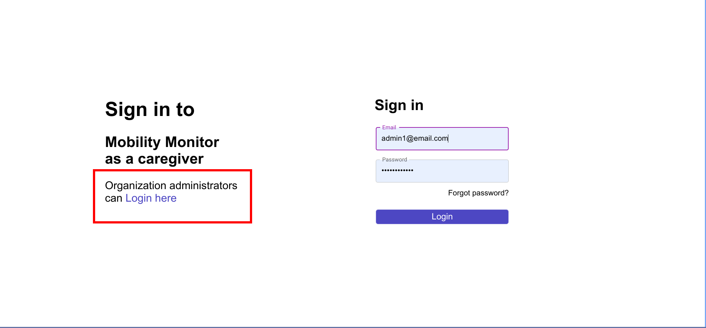
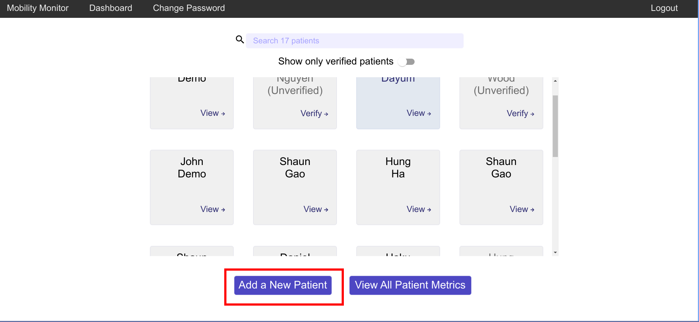
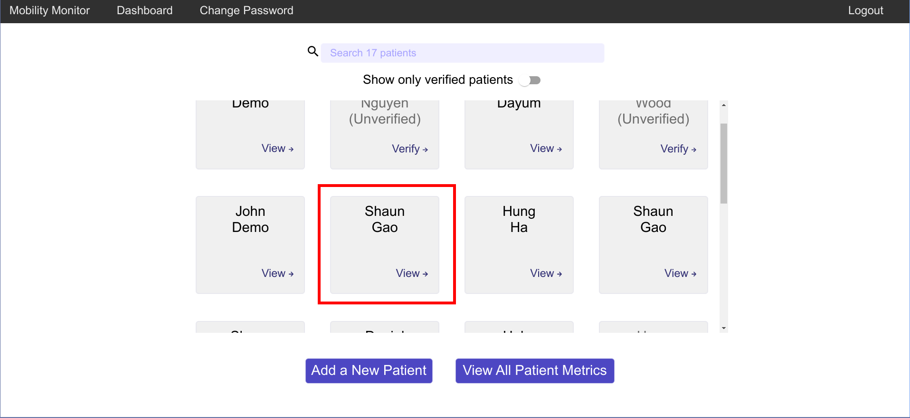
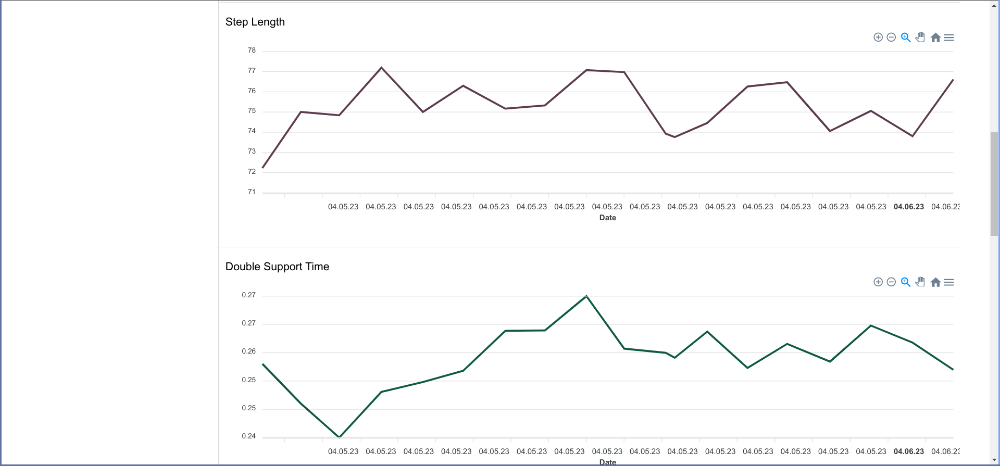
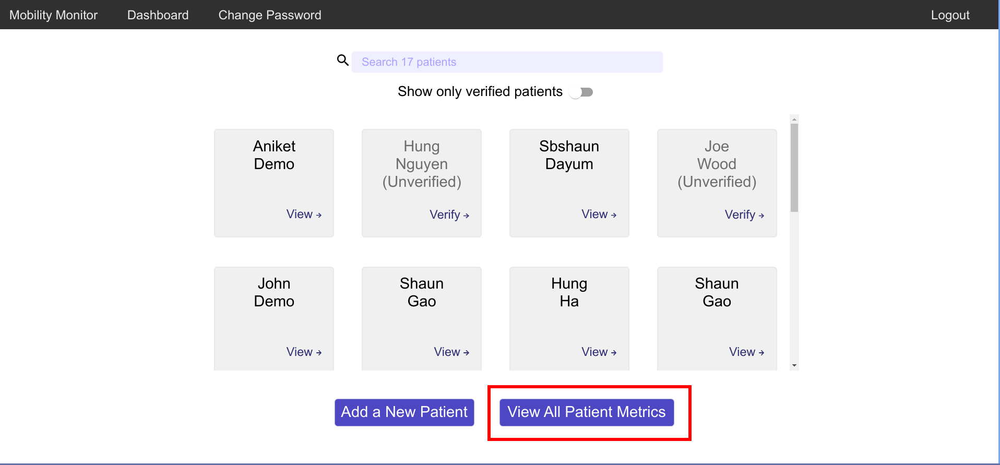
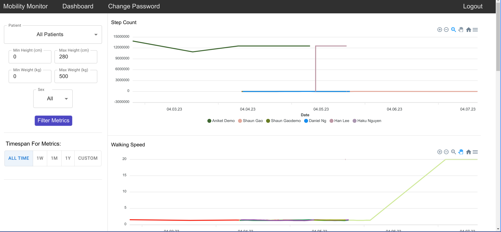
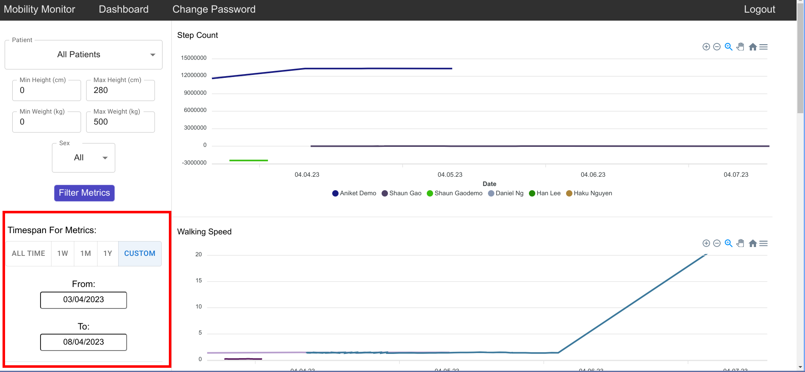
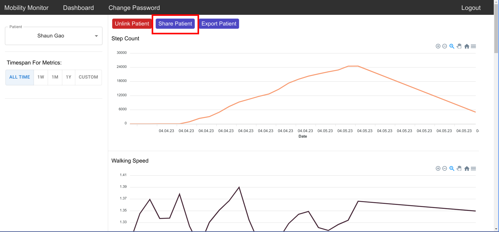
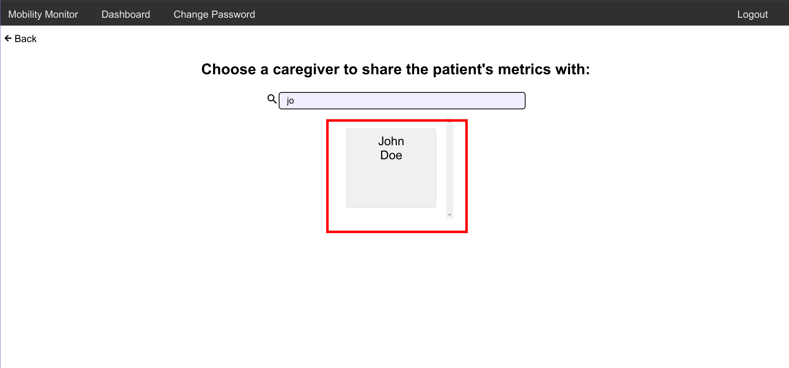

# User Guide

**Before you follow the guide, you must have the following in place:**

- [Deployment Guides](./DeploymentGuide.md)

| Index  
|:--------------------------------------------------|
| [Admin creates a caregiver](#admin-creates-a-caregiver) | Login as an admin |
| [Patient creates an account](#patient-creates-an-account) |
[Caregiver links a patient](#caregiver-links-a-patient)|
[Patient uploads mobility metrics](#patient-uploads-mobility-metrics)|
[Caregiver views metrics](#caregiver-views-metrics)|
[Caregiver shares metrics with another caregiver](#caregiver-shares-metrics-with-another-caregiver)

## Admin creates a caregiver

Once an admin is [created](./BackendDeploymentGuide.md#create-an-admin), the admin can log in as follows:
Click on the login here button as shown below:

Then click on login. Next, click on the add new caregiver button:

You will be redirected to a page to fill in caregiver information. Once you are done, click add caregiver. An email will be sent to the caregiver with instructions to set their password.

## Patient creates an account

When the patient first open the app, he/she needs to grant access to mobility metrics. Click on the bottom link to switch to the signup page. Fill out all the required fields then click `Sign Up` button. You'll be auto redirected back to the Sign In page with email and password filled out. Click the `Sign In` button to authenticate.

<table>
  <tr>
    <td></td>
    <td></td>
    <td></td>
  </tr>
</table>

## Caregiver links a patient

First, a caregiver must log in with their email and password. Then, they must click on the add a new patient button as follows:

Then, they can enter the email of the patient they wish to link and click on the add patient button. Finally, they will be brought to the following page:

Now there are two options.

Option 1: The patient can scan this qr code using their mobile app as follows:

  <kbd>
    
  </kbd>

Once the qr code is scanned, the patient is automatically linked to the caregiver.

Option 2: If the patient want to be linked remotely, they will also get an email with a verification link as follows:

The patient simply has to open this link and they will be verified

## Patient uploads mobility metrics

Once patient is already linked to at least one caregiver, the patient can view and send mobility metrics by clicking `Send Data`. Alternatively, the mobility data is also automatically uploaded in the background once every hour.

  <kbd>
    
  </kbd>

## Caregiver views metrics

To view the metrics the caregiver simply has to click on a patient from their dashboard like so:

Once the caregiver clicks on this patient, they will be brought to a page that displays the patient's metrics in graphs and a table:

The caregiver can also view the metrics of all their patients. To do so, the caregiver clicks on the view all patient metrics button:

This brings them to a page where they can view the metrics of all their patients in graphs as shown:

Additionally, the caregiver can also filter the patients by their height, weight, and sex:

Additionally, for both single patient and mutli-patient views, the caregiver can query the metrics by time:

A caregiver can also export these metrics. Lastly, a caregiver can unlink a patient by clicking on the Unlink Patient button

## Caregiver shares metrics with another caregiver

A caregiver can also share a patient's metrics with another caregvier within a same organization. To do so, the caregiver goes to a selected patient's view and clicks on the share patient button:

This brings up a view with all the caregivers in the organization. You can search for caregivers and simply click on one of them to share the patient metrics:

